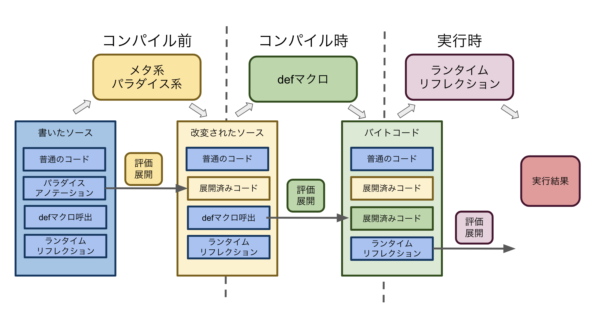

Scalaのマクロ基礎
-----
@bakenezumi


Scalaのマクロの種類①
- defマクロ
  - ScalaのASTをいじれる
  - コンパイル時に動く

- meta系
  - ScalaのASTを標準ASTに変換して色々できる


Scalaのマクロの種類②
- ランタイムリフレクション
  - 遅い

- パラダイス系
  - アノテーションで色々できる
  - 勝手にメソッドとかコンパニオンオブジェクトを増やしたりできる


Scalaのマクロの実行タイミング



簡単なdefマクロの例

```scala
import language.experimental.macros
import scala.reflect.macros.blackbox.Context

object HelloMacro {
  def hello(msg: String): Unit = macro helloImpl

  def helloImpl(c: Context)(msg: c.Expr[String]) = {
    import c.universe._
    //コンパイル時にこの処理が動き、macroを呼んだ箇所にコードが展開される
    msg.tree match { 
      case Literal(Constant("A")) => q""" println("Hello, " + $msg) """
      case Literal(Constant("B")) => q""" println("こんにちは, " + $msg) """
      case _ => c.abort(c.enclosingPosition, """"A","B"以外はコンパイルできません""")
    }
  }
}
```


実行結果

```sh
scala> HelloMacro.hello("A")
Hello, A

scala> HelloMacro.hello("B")
こんにちは, B

scala> HelloMacro.hello("C")
<console>:15: error: "A","B"以外はコンパイルできません
       HelloMacro.hello("C")
                       ^
```


永続値を持つようなEnum

```scala
sealed trait AorB {
   val value: String
}

object AorB {
  case object A extends AorB {val value = "A"}
  case object B extends AorB {val value = "B"}
  // ここが面倒
  def apply(v: String): AorB = v match {
     case AorB.A.value => AorB.A
     case AorB.B.value => AorB.B
     // case _ => ...MatchError
   }
  def unapply(ab: AorB): Option[(String)] = Option(ab.value)
}
```


Enumを抽象化

```scala
import language.experimental.macros

trait Enum {
  type V
  val value: V
}

trait EnumCompanion[E <: Enum] {
  def applyEnum(v: E#V): E = macro EnumMacro.applyEnumImpl[E, E#V]
  def unapply(e: E): Option[(E#V)] = Option(e.value)
}
```


Enumのapplyを展開するマクロ

```scala
import scala.reflect.macros.blackbox

object EnumMacro {
  def applyEnumImpl[E: c.WeakTypeTag, V: c.WeakTypeTag]
    (c: blackbox.Context)(v: c.Expr[V]): c.Expr[E] = {
    import c.universe._
    val enumType = weakTypeOf[E]
    val subclasses = enumType.typeSymbol.asClass.knownDirectSubclasses
    val cases = subclasses.map { classSymbol =>
      val subclassName = classSymbol.name.toString
      CaseDef(
        Select(Ident(TermName(subclassName)), TermName("value")),
        EmptyTree,
        Ident(TermName(subclassName))
      )
    }.toList
    c.Expr[E](Match(Ident(TermName("v")), cases))
  }  
}
```


マクロを利用したEnum実装例

```scala
sealed trait AorB extends Enum {type V = String}

object AorB extends EnumCompanion[AorB] {
  case object A extends AorB {val value = "A"}
  case object B extends AorB {val value = "B"}
  def apply(v: String) = applyEnum(v)
}

```


defマクロはだいたいこんな感じで作っていきます

Enum用のマクロを実務で使うならEnumeratumがおすすめです
https://github.com/lloydmeta/enumeratum


パラダイスを使うと...
```scala
@Holder
sealed abstract class AorB(val value: String)
object AorB {
  case object A extends AorB("A")
  case object B extends AorB("B")
}
```
- traitの実装不要
- マクロの呼び出し不要
- ただしアノテーションが必要


宣伝
-----

ってことが可能なORMappper作ってます

https://github.com/bakenezumi/domala

Doma2（Java製）のScalaラッパーです

